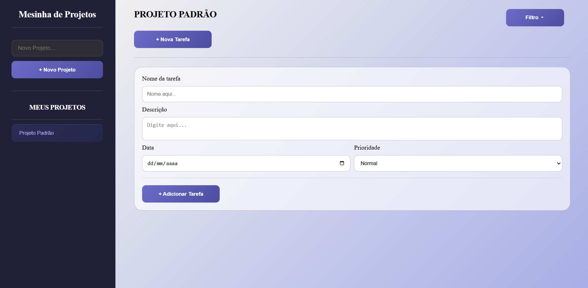
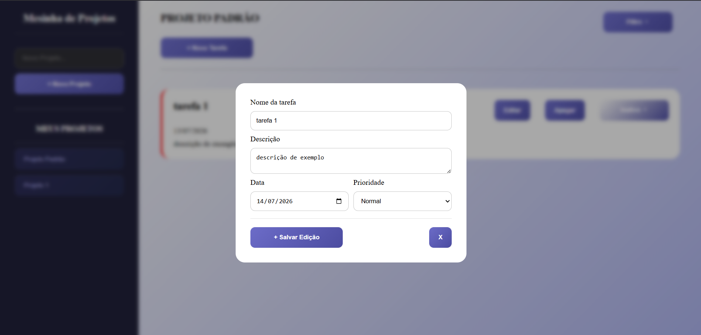
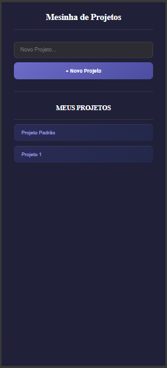
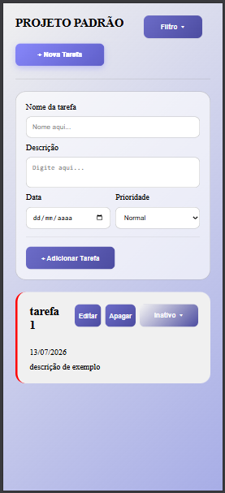
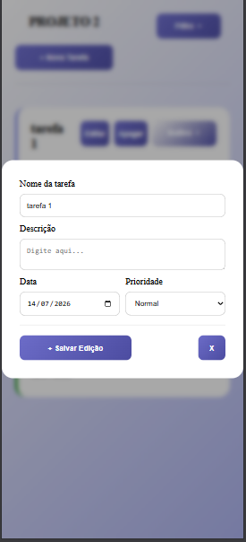

# 📋 Mesinha de Tarefas







> Aplicação de lista de tarefas desenvolvida como projeto do [The Odin Project](https://www.theodinproject.com/lessons/node-path-javascript-todo-list) — módulo JavaScript Intermediário.

🔗 **[Ver projeto ao vivo](https://thiagosantz.github.io/Mesinha-de-Tarefas/)**

---

## 📱 Também disponível para Mobile

A aplicação conta com layout responsivo para dispositivos móveis, com navegação por **swipe** entre a lista de projetos e as tarefas.

- Deslize para a **esquerda** na sidebar para abrir as tarefas
- Deslize para a **direita** na tela de tarefas para voltar aos projetos
- Clicar em um projeto também abre automaticamente as tarefas

---

## ✨ Funcionalidades

- ✅ Criar, editar e excluir **tarefas** com título, descrição, data e prioridade
- ✅ Criar, renomear e excluir **projetos**
- ✅ Indicação visual de **prioridade** (Alta 🔴 / Normal 🔵 / Baixa 🟢) via cor da borda do card
- ✅ Indicação visual de **status** (Inativo / Andamento / Concluído / Atrasado) via cor do botão
- ✅ Detecção automática de tarefas **atrasadas**
- ✅ **Filtros** por Título, Status, Data e Prioridade — com inversão de ordem
- ✅ **Persistência de dados** via `localStorage`
- ✅ Formatação de datas com **date-fns**
- ✅ Layout responsivo com navegação por **swipe no mobile**

---

## 🎯 Objetivo de Aprendizado

Este projeto foi desenvolvido para consolidar os seguintes conceitos:

| Conceito | Descrição |
|---|---|
| **Manipulação do DOM** | Criação e atualização dinâmica de elementos HTML via JavaScript puro |
| **ES6 Modules** | Separação de responsabilidades em módulos (`Tarefa`, `Projeto`, `Ui`) |
| **Webpack** | Bundling de módulos JS e CSS, dev server e build de produção |
| **Classes JavaScript** | Uso de `class`, construtores, métodos e propriedades |
| **localStorage** | Persistência de dados no navegador com serialização JSON |
| **Eventos de Touch** | Implementação de swipe para navegação mobile com `touchstart`/`touchend` |
| **date-fns** | Formatação de datas com biblioteca externa via npm |
| **CSS Responsivo** | Media queries para adaptação do layout em dispositivos móveis |

---

## 🛠️ Tecnologias

- HTML5 / CSS3
- JavaScript (ES6+)
- [Webpack 5](https://webpack.js.org/)
- [date-fns](https://date-fns.org/)
- [Font Awesome](https://fontawesome.com/) (ícones)

---

## 🚀 Como rodar localmente

```bash
# Clone o repositório
git clone https://github.com/thiagoSantz/Mesinha-de-Tarefas.git

# Entre na pasta
cd Mesinha-de-Tarefas

# Instale as dependências
npm install

# Inicie o servidor de desenvolvimento
npm start
```

Acesse em: `http://localhost:8080`

---

## 📦 Build para produção

```bash
npm run build
```

Os arquivos otimizados serão gerados na pasta `dist/`.

---

## 📁 Estrutura do Projeto

```
src/
├── index.html       # Template HTML
├── index.js         # Ponto de entrada — inicializa a aplicação
├── Tarefas.js       # Classe Tarefa (lógica de dados)
├── Projeto.js       # Classe Projeto (lógica de dados)
├── Ui.js            # Classe Ui (manipulação do DOM)
├── style.css        # Estilos principais
└── mobile.css       # Estilos responsivos para mobile
```

---

Desenvolvido por **Thiago Santz** como parte do currículo do [The Odin Project](https://www.theodinproject.com/) 🌱
